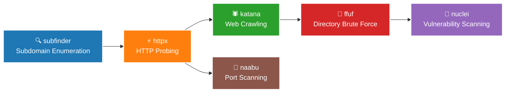

<div align="center">
  


</div>

<div align="center">
  
[](https://git.io/typing-svg)

</div>

<div align="center">

[](#)
[](https://github.com/IaKalandia)
[](https://hackerone.com/)
[](mailto:iakalandia1@gmail.com)

</div>

---

<div align="center">

## 🎯 **Professional Overview**

</div>

### 💡 **About Me**

```typescript
interface IaKalandia {
    // Core Focus
    readonly role: "Security Researcher";
    readonly status: "Active Bug Bounty Hunter & Open Source Security Contributor";
    readonly background: ["Cybersecurity", "Vulnerability Research", "Recon Engineering"];
    
    // Security Skills
    readonly specialties: [
        "Web Application Security",
        "Attack Surface Enumeration",
        "API Security Testing",
        "CORS & Access Control Analysis",
        "Open Source Supply Chain Security"
    ];
    
    // Recon Framework
    readonly tools: ["subfinder", "httpx", "katana", "ffuf", "nuclei", "naabu", "Burp Suite"];
    readonly languages: ["Python", "Bash", "SQL"];
    
    // Personal Traits
    readonly qualities: ["Self-directed", "Detail-oriented", "Persistent"];
    readonly mission: "Securing systems through offensive research and open source contribution";
}
```

### 📊 **Key Highlights**

<div align="center" style="padding: 10px;">


</div>

---

<div align="center">

# 🔒 **Security Research**

</div>

<div align="center">

### **Notable Findings**

</div>

<div align="center">

| 🔍 **Finding Type** | ⚡ **Severity** | 📋 **Status** |
|---------------------|-----------------|---------------|
| CORS Misconfiguration on Production API | **Critical** | Reported to vendor |
| Exposed API Documentation — 938+ Endpoints | **High** | Reported to vendor |
| Unauthenticated API Endpoints on Production | **High** | Reported to vendor |
| Third-party Service Information Disclosure | **Medium** | Reported to vendor |
| Cloud Infrastructure & Service Mesh Exposure | **Low-Medium** | Reported to vendor |
| + 3 additional findings | **Low / Info** | Reported to vendor |

</div>

> Conducted a full security assessment of a major automotive company's autonomous vehicle data platform. Enumerated 26 subdomains, identified 21 live hosts, and discovered 8 vulnerabilities including a Critical CORS misconfiguration combined with 938+ exposed API endpoints. All findings responsibly disclosed to the vendor's security team.

---

<div align="center">

# 🚀 **Recon Framework**

</div>

<div align="center">



</div>

---

<div align="center">

# 🛠️ **Technology Stack**

</div>

<div align="center">

### **🔒 Security Tools**

<div style="margin: 15px 0;">


</div>

### **🔍 Recon Tools**

<div style="margin: 15px 0;">


</div>

### **🐍 Programming & Scripting**

<div style="margin: 15px 0;">


</div>

### **💻 Platforms & Tools**

<div style="margin: 15px 0;">


</div>

</div>

---

<div align="center">

# 🌐 **Open Source Security**

</div>

<div align="center">

Currently contributing to open source supply chain security through the **OpenSSF** (Open Source Security Foundation) ecosystem.

<div style="margin: 15px 0;">


</div>

</div>

---

<div align="center">

# 📚 **Education & Certifications**

</div>

<div align="center">

<table width="90%">
<tr>
<td align="center" width="50%" style="padding: 20px;">
<div style="background: linear-gradient(135deg, #1f4e79, #2980b9); border-radius: 15px; padding: 25px; margin: 15px; color: white;">

<br><b>Teaching Turkish as a Foreign Language</b><br>
<sub>2013-2016 | Izmir, Turkiye</sub>
</div>
</td>
<td align="center" width="50%" style="padding: 20px;">
<div style="background: linear-gradient(135deg, #8B4513, #CD853F); border-radius: 15px; padding: 25px; margin: 15px; color: white;">

<br><b>Bachelor's in Oriental Studies</b><br>
<sub>2009-2013 | Tbilisi, Georgia</sub>
</div>
</td>
</tr>
</table>

<div style="background: linear-gradient(135deg, rgba(35,47,62,0.1), rgba(255,153,0,0.1)); border-radius: 20px; padding: 30px; margin: 30px auto; max-width: 800px; border: 2px solid #232F3E;">

### 📜 **Certifications**

<div align="center">


</div>

**Current Learning:**
- 🔒 Open Source Supply Chain Security (OpenSSF / SLSA)
- 🐍 Python for Security Automation
- 🕵️ Advanced Web Application Penetration Testing

</div>

</div>

---

<div align="center">

# 🌍 **Languages**

</div>

<div align="center">

<table width="80%">
<tr>
<td align="center" style="padding: 20px;">
<div style="background: linear-gradient(135deg, #E91E63, #F8BBD9); border-radius: 15px; padding: 25px; margin: 15px; color: white;">

<br><b>Native</b>
</div>
</td>
<td align="center" style="padding: 20px;">
<div style="background: linear-gradient(135deg, #DC143C, #FF6B6B); border-radius: 15px; padding: 25px; margin: 15px; color: white;">

<br><b>Fluent</b>
</div>
</td>
<td align="center" style="padding: 20px;">
<div style="background: linear-gradient(135deg, #0052CC, #4A90E2); border-radius: 15px; padding: 25px; margin: 15px; color: white;">

<br><b>Proficient</b>
</div>
</td>
</tr>
</table>

</div>

---

<div align="center">

# 📈 **GitHub Analytics**

</div>

<div align="center">

<div style="display: flex; flex-wrap: wrap; justify-content: center; gap: 20px;">

<div align="center">


</div>

<div align="center">


</div>

</div>


<div style="margin: 20px 0;">


</div>

</div>

---

<div align="center">


<div style="background: linear-gradient(135deg, rgba(0,217,255,0.1), rgba(255,107,107,0.1)); border-radius: 15px; padding: 25px; margin: 20px auto; max-width: 800px;">

### 💭 **Philosophy**

*"The best way to secure a system is to think like the attacker — find the weaknesses before they do."*

</div>

[](https://github.com/IaKalandia)

</div>
