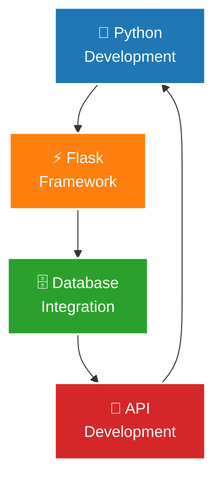

<div align="center">
  


</div>

<div align="center">
  
[](https://git.io/typing-svg)

</div>

<div align="center">

[](#)
[](https://github.com/IaKalandia)
[](mailto:iakalandia1@gmail.com)

</div>

---

<div align="center">

## 🎯 **Professional Overview**

</div>

### 💡 **About Me**

```typescript
interface IaKalandia {
    // Core Focus
    readonly role: "Backend Developer";
    readonly status: "Transitioning into Web Development";
    readonly background: ["Administration", "Education", "Leadership"];
    
    // Technical Skills
    readonly languages: ["Python", "SQL", "HTML5", "CSS3"];
    readonly frameworks: ["Flask", "BeautifulSoup", "Requests"];
    readonly databases: ["MySQL", "PostgreSQL"];
    readonly specialties: [
        "REST API Development",
        "Web Scraping",
        "Database Management",
        "Secure Coding Practices"
    ];
    
    // Personal Traits
    readonly qualities: ["Self-motivated", "Detail-oriented", "Problem-solver"];
    readonly approach: "Lifelong learner building scalable applications";
    readonly mission: "Creating efficient backend solutions";
}
```

### 📊 **Key Highlights**

<div align="center" style="padding: 10px;">


</div>

### 🎯 **Current Focus**

<div align="center">



</div>

---

<div align="center">

# 🚀 **Technology Stack**

</div>

<div align="center">

### **🐍 Programming Languages**

<div style="margin: 15px 0;">


</div>

### **🔧 Frameworks & Libraries**

<div style="margin: 15px 0;">


</div>

### **🗄️ Databases**

<div style="margin: 15px 0;">


</div>

### **🛠️ Tools & Platforms**

<div style="margin: 15px 0;">


</div>

### **🔒 Security & Best Practices**

<div style="margin: 15px 0;">


</div>

</div>

---

<div align="center">

# 🎨 **Featured Projects**

</div>

<div align="center">

| 🚀 **Project** | 📖 **Description** | ⚡ **Tech Stack** | 🔗 **Status** |
|----------------|-------------------|-------------------|---------------|
| **Glovo Price Tracker**<br>*In Progress* | Developing a comprehensive tool to gather and analyze price data from the Glovo website using web scraping and API integration for market research and price monitoring. |     | 🚧 **In Development** |
| **Portfolio Website**<br>*Completed* | Created a dynamic personal portfolio website with Flask backend serving project content through Jinja2 templates. Features responsive design and clean architecture. |     | ✅ **Live** |

</div>

---

<div align="center">

# 📚 **Education & Certifications**

</div>

<div align="center">

<table width="90%">
<tr>
<td align="center" width="50%" style="padding: 20px;">
<div style="background: linear-gradient(135deg, #1f4e79, #2980b9); border-radius: 15px; padding: 25px; margin: 15px; color: white;">

<br><b>Teaching Turkish as a Foreign Language</b><br>
<sub>2013-2016 | Izmir, Türkiye</sub>
</div>
</td>
<td align="center" width="50%" style="padding: 20px;">
<div style="background: linear-gradient(135deg, #8B4513, #CD853F); border-radius: 15px; padding: 25px; margin: 15px; color: white;">

<br><b>Bachelor's in Oriental Studies</b><br>
<sub>2009-2013 | Tbilisi, Georgia</sub>
</div>
</td>
</tr>
</table>

<div style="background: linear-gradient(135deg, rgba(35,47,62,0.1), rgba(255,153,0,0.1)); border-radius: 20px; padding: 30px; margin: 30px auto; max-width: 800px; border: 2px solid #232F3E;">

### 📜 **Certifications**

<div align="center">


</div>

**Current Learning:**
- 🐍 MIT Introduction to Python (In Progress)
- 🔧 Advanced Flask Development
- 📊 Data Structures & Algorithms

</div>

</div>

---

<div align="center">

# 🌍 **Professional Experience**

</div>

<div align="center">

<table width="95%">
<tr>
<td align="center" style="padding: 15px;">
<div style="background: linear-gradient(135deg, #2E7D32, #4CAF50); border-radius: 15px; padding: 20px; margin: 10px; color: white;">

<br><b>Sonniva Georgia, Inc.</b><br>
<sub>2020-2021 | Tbilisi, Georgia</sub>
<br><small>• Managed operations & improved workflow efficiency by 20%</small>
</div>
</td>
<td align="center" style="padding: 15px;">
<div style="background: linear-gradient(135deg, #1976D2, #42A5F5); border-radius: 15px; padding: 20px; margin: 10px; color: white;">

<br><b>Global Development Company</b><br>
<sub>2018-2020 | Tbilisi, Georgia</sub>
<br><small>• Coordinated executive meetings & strategic planning</small>
</div>
</td>
</tr>
<tr>
<td align="center" style="padding: 15px;">
<div style="background: linear-gradient(135deg, #7B1FA2, #BA68C8); border-radius: 15px; padding: 20px; margin: 10px; color: white;">

<br><b>Contact Film LLC</b><br>
<sub>Jan-Apr 2018 | Tbilisi, Georgia</sub>
<br><small>• Provided translations & improved delivery by 15%</small>
</div>
</td>
<td align="center" style="padding: 15px;">
<div style="background: linear-gradient(135deg, #F57C00, #FFB74D); border-radius: 15px; padding: 20px; margin: 10px; color: white;">

<br><b>Language Center, Inc.</b><br>
<sub>2016-2018 | Tbilisi, Georgia</sub>
<br><small>• Taught Turkish & Georgian to diverse learners</small>
</div>
</td>
</tr>
</table>

</div>

---

<div align="center">

# 🌐 **Languages**

</div>

<div align="center">

<table width="80%">
<tr>
<td align="center" style="padding: 20px;">
<div style="background: linear-gradient(135deg, #E91E63, #F8BBD9); border-radius: 15px; padding: 25px; margin: 15px; color: white;">

<br><b>Native</b>
</div>
</td>
<td align="center" style="padding: 20px;">
<div style="background: linear-gradient(135deg, #DC143C, #FF6B6B); border-radius: 15px; padding: 25px; margin: 15px; color: white;">

<br><b>Fluent</b>
</div>
</td>
<td align="center" style="padding: 20px;">
<div style="background: linear-gradient(135deg, #0052CC, #4A90E2); border-radius: 15px; padding: 25px; margin: 15px; color: white;">

<br><b>Proficient</b>
</div>
</td>
</tr>
</table>

</div>

---

<div align="center">

# 📈 **GitHub Analytics**

</div>

<div align="center">

<div style="display: flex; flex-wrap: wrap; justify-content: center; gap: 20px;">

<div align="center">


</div>

<div align="center">


</div>

</div>


<div style="margin: 20px 0;">


</div>

</div>

---

<div align="center">

# 🌱 **Beyond the Code**

</div>

<div align="center">

<table width="90%">
  <tr>
    <td align="center" style="padding: 15px;">
      <div style="background: linear-gradient(135deg, #9C27B0, #E1BEE7); border-radius: 15px; padding: 20px; margin: 10px;">
        
        <br><sub><i>Always learning new libraries</i></sub>
      </div>
    </td>
    <td align="center" style="padding: 15px;">
      <div style="background: linear-gradient(135deg, #4CAF50, #8BC34A); border-radius: 15px; padding: 20px; margin: 10px;">
        
        <br><sub><i>Debugging is my meditation</i></sub>
      </div>
    </td>
    <td align="center" style="padding: 15px;">
      <div style="background: linear-gradient(135deg, #00796B, #4DB6AC); border-radius: 15px; padding: 20px; margin: 10px;">
        
        <br><sub><i>Knowledge is power</i></sub>
      </div>
    </td>
  </tr>
  <tr>
    <td align="center" style="padding: 15px;">
      <div style="background: linear-gradient(135deg, #03A9F4, #81D4FA); border-radius: 15px; padding: 20px; margin: 10px;">
        
        <br><sub><i>Connecting cultures through code</i></sub>
      </div>
    </td>
    <td align="center" style="padding: 15px;">
      <div style="background: linear-gradient(135deg, #607D8B, #90A4AE); border-radius: 15px; padding: 20px; margin: 10px;">
        
        <br><sub><i>Extracting insights from data</i></sub>
      </div>
    </td>
    <td align="center" style="padding: 15px;">
      <div style="background: linear-gradient(135deg, #FF5722, #FF8A65); border-radius: 15px; padding: 20px; margin: 10px;">
        
        <br><sub><i>Building bridges between systems</i></sub>
      </div>
    </td>
  </tr>
</table>

</div>

---

<div align="center">


<div style="background: linear-gradient(135deg, rgba(0,217,255,0.1), rgba(255,107,107,0.1)); border-radius: 15px; padding: 25px; margin: 20px auto; max-width: 800px;">

### 💭 **Philosophy**

*"Code is poetry in motion — every function tells a story, every algorithm solves a puzzle, and every project builds a better tomorrow."*

</div>

[](https://github.com/IaKalandia)

---


</div>