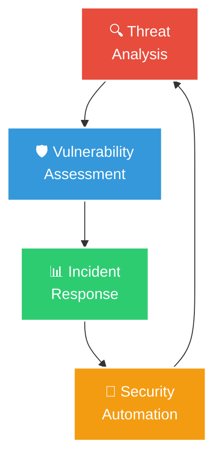

<div align="center">
  


</div>

<div align="center">
  
[](https://git.io/typing-svg)

</div>

<div align="center">

[](https://linkedin.com/in/ia-kalandia-a1253726b)
[](https://github.com/IaKalandia)
[](mailto:iakalandia1@gmail.com)
[](https://tryhackme.com)

</div>

---

<div align="center">

## 🎯 **Professional Overview**

</div>

### 💡 **About Me**

```typescript
interface IaKalandia {
    // Core Focus
    readonly role: "Cybersecurity Professional";
    readonly status: "Completing Google Cybersecurity Certificate";
    readonly location: "Denver, CO";
    
    // Security Skills
    readonly specialties: [
        "Threat & Vulnerability Assessment",
        "Network Security Analysis",
        "Incident Response",
        "SIEM & Log Analysis",
        "Security Scripting"
    ];
    
    // Technical Arsenal
    readonly tools: [
        "Wireshark", "Nmap", "Nessus",
        "Burp Suite", "Metasploit", "MITRE ATT&CK"
    ];
    readonly languages: ["Python", "Bash", "SQL"];
    readonly systems: ["Kali Linux", "Ubuntu", "macOS"];
    
    // Personal Traits
    readonly qualities: ["Detail-oriented", "Quick learner", "Reliable"];
    readonly approach: "Hands-on security researcher";
    readonly mission: "Protecting digital assets through proactive security";
}
```

### 📊 **Key Highlights**

<div align="center" style="padding: 10px;">


</div>

### 🎯 **Current Focus**

<div align="center">



</div>

---

<div align="center">

# 🚀 **Security Arsenal**

</div>

<div align="center">

### **🔧 Security Tools**

<div style="margin: 15px 0;">


</div>

### **💻 Operating Systems**

<div style="margin: 15px 0;">


</div>

### **🐍 Programming & Scripting**

<div style="margin: 15px 0;">


</div>

### **🎯 Core Competencies**

<div style="margin: 15px 0;">


</div>

</div>

---

<div align="center">

# 🎨 **Lab Experience & Projects**

</div>

<div align="center">

| 🚀 **Project** | 📖 **Description** | ⚡ **Skills Applied** | 🔗 **Platform** |
|----------------|-------------------|-------------------|---------------|
| **Network Reconnaissance**<br>*TryHackMe* | Conducted vulnerability scans on sandboxed hosts using Nmap and Nessus. Documented CVEs and provided detailed remediation steps for identified vulnerabilities. |    | 🎯 **TryHackMe** |
| **Packet Analysis**<br>*TryHackMe* | Captured and analyzed TCP packets using Wireshark to identify plaintext credentials and demonstrate security implications of insecure protocols. |    | 🎯 **TryHackMe** |
| **Web Application Security**<br>*TryHackMe* | Detected and exploited XSS and SQL injection vulnerabilities in simulated web applications. Proposed secure coding practices and remediation strategies. |    | 🎯 **TryHackMe** |

</div>

---

<div align="center">

# 📚 **Training & Certifications**

</div>

<div align="center">

<table width="90%">
<tr>
<td align="center" width="50%" style="padding: 20px;">
<div style="background: linear-gradient(135deg, #4285F4, #34A853); border-radius: 15px; padding: 25px; margin: 15px; color: white;">

<br><b>Cybersecurity Professional Certificate</b><br>
<sub>Coursera | Expected Nov 2025</sub>
<br><br>
<small>
• Security Operations<br>
• Incident Response<br>
• SQL for Cybersecurity<br>
• Threat Modeling
</small>
</div>
</td>
<td align="center" width="50%" style="padding: 20px;">
<div style="background: linear-gradient(135deg, #212C42, #00C176); border-radius: 15px; padding: 25px; margin: 15px; color: white;">

<br><b>PreSecurity Path</b><br>
<sub>TryHackMe | Expected Oct 2025</sub>
<br><br>
<small>
• Linux Fundamentals<br>
• Networking Essentials<br>
• OWASP Top 10<br>
• Privilege Escalation
</small>
</div>
</td>
</tr>
</table>

<div style="background: linear-gradient(135deg, rgba(35,47,62,0.1), rgba(220,20,60,0.1)); border-radius: 20px; padding: 30px; margin: 30px auto; max-width: 800px; border: 2px solid #DC143C;">

### 🎯 **Continuous Learning**

<div align="center">


</div>

**Currently Studying:**
- 🔐 Advanced Threat Detection & Analysis
- 🛡️ Security Operations Center (SOC) Fundamentals
- 🔍 Digital Forensics & Incident Response
- ⚡ Security Automation with Python

</div>

</div>

---

<div align="center">

# 🎓 **Academic Background**

</div>

<div align="center">

<table width="90%">
<tr>
<td align="center" width="50%" style="padding: 20px;">
<div style="background: linear-gradient(135deg, #1f4e79, #2980b9); border-radius: 15px; padding: 25px; margin: 15px; color: white;">

<br><b>Master's Degree</b><br>
<sub>Teaching Turkish as a Foreign Language</sub><br>
<sub>2013-2016 | İzmir, Türkiye</sub>
</div>
</td>
<td align="center" width="50%" style="padding: 20px;">
<div style="background: linear-gradient(135deg, #8B4513, #CD853F); border-radius: 15px; padding: 25px; margin: 15px; color: white;">

<br><b>Bachelor's Degree</b><br>
<sub>Oriental Studies</sub><br>
<sub>2009-2013 | Tbilisi, Georgia</sub>
</div>
</td>
</tr>
</table>

</div>

---

<div align="center">

# 🌐 **Languages**

</div>

<div align="center">

<table width="80%">
<tr>
<td align="center" style="padding: 20px;">
<div style="background: linear-gradient(135deg, #E91E63, #F8BBD9); border-radius: 15px; padding: 25px; margin: 15px; color: white;">

<br><b>Native</b>
</div>
</td>
<td align="center" style="padding: 20px;">
<div style="background: linear-gradient(135deg, #0052CC, #4A90E2); border-radius: 15px; padding: 25px; margin: 15px; color: white;">

<br><b>Fluent</b>
</div>
</td>
<td align="center" style="padding: 20px;">
<div style="background: linear-gradient(135deg, #DC143C, #FF6B6B); border-radius: 15px; padding: 25px; margin: 15px; color: white;">

<br><b>Advanced</b>
</div>
</td>
</tr>
</table>

</div>

---

<div align="center">

# 📈 **GitHub Analytics**

</div>

<div align="center">

<div style="display: flex; flex-wrap: wrap; justify-content: center; gap: 20px;">

<div align="center">


</div>

<div align="center">


</div>

</div>


<div style="margin: 20px 0;">


</div>

</div>

---

<div align="center">

# 🌱 **Beyond Security**

</div>

<div align="center">

<table width="90%">
  <tr>
    <td align="center" style="padding: 15px;">
      <div style="background: linear-gradient(135deg, #DC143C, #FF6B6B); border-radius: 15px; padding: 20px; margin: 10px;">
        
        <br><sub><i>Capture The Flag competitions</i></sub>
      </div>
    </td>
    <td align="center" style="padding: 15px;">
      <div style="background: linear-gradient(135deg, #4CAF50, #8BC34A); border-radius: 15px; padding: 20px; margin: 10px;">
        
        <br><sub><i>Digital forensics & incident response</i></sub>
      </div>
    </td>
    <td align="center" style="padding: 15px;">
      <div style="background: linear-gradient(135deg, #00796B, #4DB6AC); border-radius: 15px; padding: 20px; margin: 10px;">
        
        <br><sub><i>Always learning new techniques</i></sub>
      </div>
    </td>
  </tr>
  <tr>
    <td align="center" style="padding: 15px;">
      <div style="background: linear-gradient(135deg, #3498db, #81D4FA); border-radius: 15px; padding: 20px; margin: 10px;">
        
        <br><sub><i>Proactive security mindset</i></sub>
      </div>
    </td>
    <td align="center" style="padding: 15px;">
      <div style="background: linear-gradient(135deg, #9C27B0, #E1BEE7); border-radius: 15px; padding: 20px; margin: 10px;">
        
        <br><sub><i>Python for security tasks</i></sub>
      </div>
    </td>
    <td align="center" style="padding: 15px;">
      <div style="background: linear-gradient(135deg, #FF5722, #FF8A65); border-radius: 15px; padding: 20px; margin: 10px;">
        
        <br><sub><i>Deep packet inspection</i></sub>
      </div>
    </td>
  </tr>
</table>

</div>

---

<div align="center">


<div style="background: linear-gradient(135deg, rgba(220,20,60,0.1), rgba(0,82,204,0.1)); border-radius: 15px; padding: 25px; margin: 20px auto; max-width: 800px;">

### 💭 **Philosophy**

*"Security is not a product, but a process — every vulnerability patched, every threat analyzed, and every incident responded to builds a safer digital world."*

</div>

[](https://github.com/IaKalandia)

---


**📧 Open to opportunities in:** SOC Analyst • Cybersecurity Analyst • Security Operations

</div>
